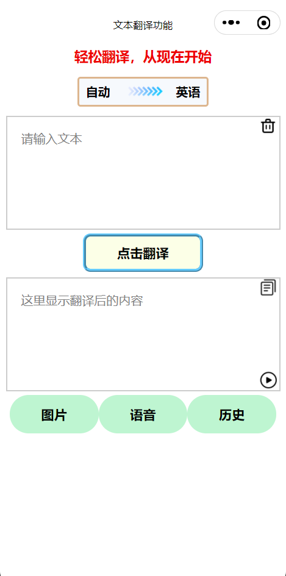
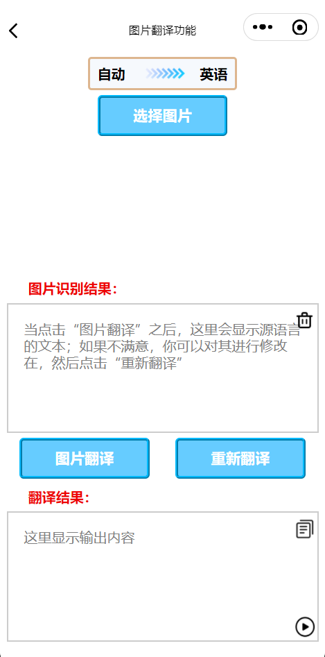
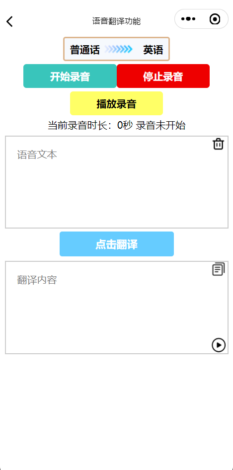
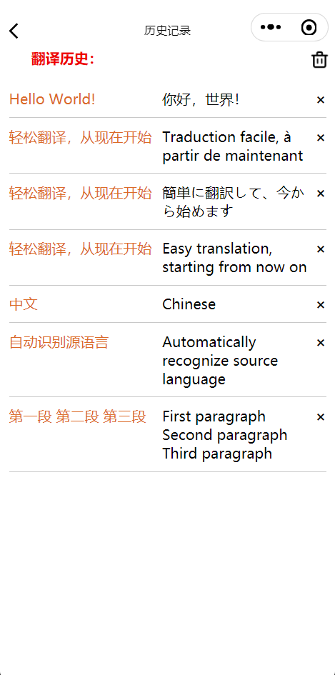

# 翻译小程序

<h1>1.成员列表：</h1>
<h3>组长：宋宇成</h3>
<h3>组员：周唯</h3>

<h1>2.扫码体验：</h1>
<div align="center">
  
</div>

<h1>3.界面展示：</h1>
<div align="center">
  
  
  
  
</div>

<h1>4.项目功能：</h1>
<h3>①实现翻译功能</h3>
<p>调用百度翻译API，并以此给出自定义的调用API，实现更方便的翻译功能实现。</p>
<h3>②实现历史记录保存、图片翻译与语音翻译</h3>
<p>底部导航栏通向这三个页面。</p>

<h1>5.项目结构：</h1>
<p>该项目的主要结构与重要文件如下：</p>

```
·
├─code                            // 代码目录
│  ├─img                          // 小程序内部图像
│  ├─pages                        // 小程序的各个界面
│  │  ├─history                   // 历史界面
│  │  ├─index                     // 主界面
│  │  ├─picture                   // 图片翻译界面
│  │  └─voice                     // 语音翻译界面
│  ├─utils                        // 插件
│  │  ├─baidu-translate-api.js    // 百度翻译API
│  │  ├─md5.min.js                // 鉴权码
│  │  ├─util.js                   // 获取当前时间
│  ├─app.js                       // 入口文件
│  ├─app.json                     // 全局配置
│  └─app.wxss                     // 定义全局样式(输入框等)
│
├─docs                            // 文档目录
│  ├─架构设计.md
│  ├─界面原型文档.md
│  ├─组件接口.md
│  ├─需求分析.md
│  ├─时序图.md
|
└─images                          // 文档图片目录
```

<h1>6.人员分工：</h1>
<h2>6.1.宋宇成</h2>

1. **负责Github仓库管理：** 宋宇成负责整个Github仓库的管理工作，包括代码的整理、归档以及版本的管理。同时负责编写详实的README文档，以便于其他团队成员以及可能接触项目的人对项目有明确的了解。
2. **共同进行设计：** 积极参与系统设计，利用在软件工程课上所学与课余积累，帮助设计出高效且易于维护的系统。利用平日里的设计功底，设计简洁美观易实现的界面。帮助分析需求，以减少漏掉的部分。
3. **全局的翻译API：** 百度提供的翻译API调用不够简易，为了便于本小程序各个地方调用`文本翻译为文本`的功能，他将翻译功能定义成`translate_api`，只需要输入文本、源语言、目标语言就能够实现翻译。
4. **全局的文本转语音API：** 微信提供的文本转语音的API也不容易调用，且缺少足够的错误机制，为了在调用时自动查错，他将文本转语音功能定义成`Text2Voice`，只需要输入文本和语种就能实现文本转语音然后输出语音的功能。
5. **各个界面的制作：** 宋宇成积极参与界面原型到界面的开发。他完成了主界面、图片翻译界面、语音翻译界面的制作，并对按钮、输入框等进行统一规定，比如统一成`picker_container,input_container,output_container`而无需在各个页面自行实现这个功能，便于各个界面的相同部分统一管理，减少问题的产生。
6. **主界面的翻译功能：** 宋宇成实现了主界面的文本翻译成文本的功能，调整了按钮之间的布局模式(相对布局)，并增加了清空、复制、朗读等功能，便于用户使用。
7. **图片识别与翻译功能：** 宋宇成实现了拍照或本地上传图片，然后使用OCR转化成对应文本的功能。然后将文本翻译成对应的目标语言。并允许用户修改原文本，避免OCR不准确影响用户使用。
8. **语音录制、暂停、停止等功能：** 宋宇成实现了语音界面的部分功能，方便与前面的统一管理，便于制定各个`container`的关联事件与样式。
9. **性能优化：** 宋宇成将专注于系统的性能优化，通过合理的代码架构和算法优化，他将确保系统在高并发、高延迟等情况下的稳定运行。
10. **编写文档：** 为了保证项目的可维护性和持续性，宋宇成负责编写清晰且详细的开发文档，以便于后续的开发和维护工作。

<h2>6.2.周唯</h2>

1. **进行需求分析：** 在理解课题的要求后，深入分析项目的需求与用户使用的情景，并将其转化为用户需求与系统需求两类，同时负责撰写需求分析文档。
2. **共同进行设计：** 一同参与项目的设计，考量每条设计的决策，针对系统的实现向其他开发人员提出优化想法，共同探讨,力争维护系统的可靠性与可用性。
3. **界面的设计与优化：** 周唯将主要负责各个界面原型的设计，独立完成部分界面的开发实现并在其余界面上辅助宋宇成进行优化，完成了历史界面、语音翻译界面，辅助完成了主界面，同时优化了各界面的图标位置，实现响应式设计，避免了各机型屏幕大小不同导致的显示问题。
4. **翻译历史的存储与加载：** 周唯实现了调用主界面翻译服务记录每条历史记录的源文本、译文及翻译语言，显示在历史界面中；同时实现了每条历史均可单独删除，也可选择清空全部历史的功能；此外还负责了重载单条历史到主界面重新翻译的功能。
5. **语音识别与翻译功能：** 周唯实现了接收录制的音频地址，将其转化为Base64编码，并实现调用语音识别接口，将语音转化为文本，翻译为目标语言。修改识别文本与复制翻译文本功能在这里同样适用，满足用户需求。
6. **架构的设计：** 设计了项目系统的整体框架，采用分层架构模式，确保项目各层间的独立性，强化系统可依赖性。
7. **编写文档：** 将自己所负责的部分归档整理，以供其他开发人员更好地掌握系统开发进度，同时便于用户理解项目开发过程与使用方式。
8. **代码优化：** 周唯将协助其他开发人员对系统代码逻辑进行优化，简化冗余代码，使代码逻辑更加清晰，优化项目整体结构，强化项目可维护性。
