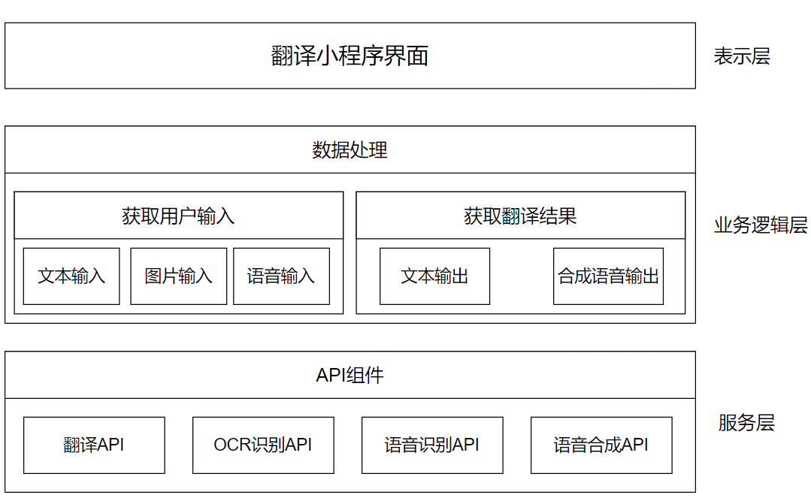

## 架构设计
- 翻译小程序采用分层架构的模式，示例图如下：
 

    

### 1.表示层（Presentation Layer）

表示层就是展现给客户的界面，用于展示用户输入以及服务端返回的数据。这一层主要负责将用户请求传递给下一层，并将处理结果返回给用户。

### 2.业务逻辑层（Business Layer）
业务逻辑层用于存放所有的业务实现，是连接表示层与服务层的桥梁，实现了翻译的核心算法和业务逻辑。用户输入的数据通过业务逻辑层的处理发给服务层；服务层返回的数据通过业务逻辑层发送给界面展示。
在我们的翻译小程序中，业务逻辑层主要处理的数据包含用户的输入数据与所采用接口服务返回的翻译结果。

### 3.服务层（Service Layer）
服务层主要管理数据，负责数据存储和访问，把业务逻辑层提交的用户输入的数据保存，把业务逻辑层请求的数据返回给业务逻辑层。
在我们的翻译小程序中，服务层包括了翻译API获取翻译结果、OCR识别图片中文字和语音合成等接口的调用。
