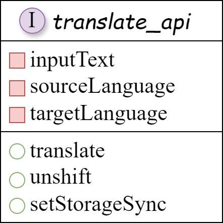
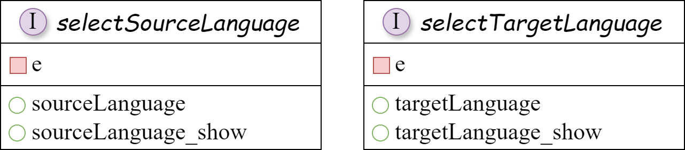
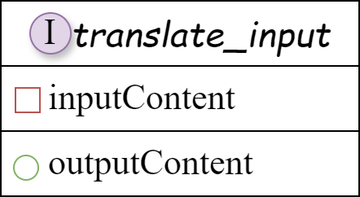
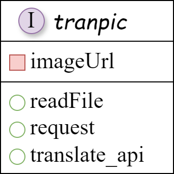
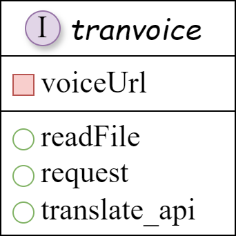
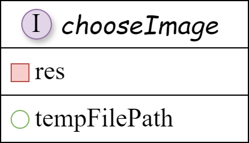
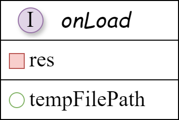
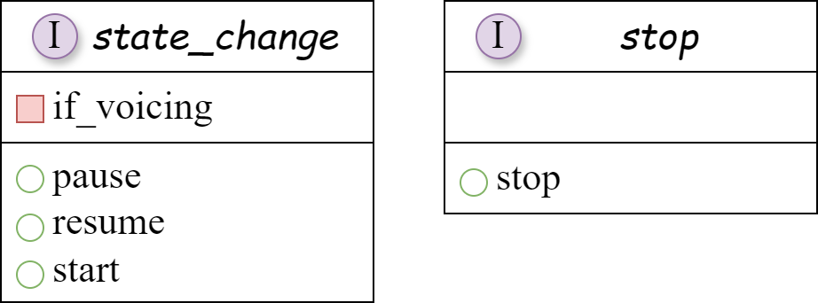

## 一、组件接口设计

### 1.1 全局的翻译api接口

<div align = "center">
    
</div>

```
:param inputText: [传入]翻译的文本
:param sourceLanguage: [传入]原语言，可选'auto'
:param targetLanguage: [传入]目标语言
```
- `translate(inputText: String, sourceLanguage: String, targetLanguage: String): json`：将inputText从sourceLanguage的语种翻译为targetLanguage的语种，并自动更新历史界面。
- `unshift(dst: str, src: str, from: str, to: str): `更新历史界面的数组
- `setStorageSync(history: list):` 用history数组更新历史界面


### 1.2 语种选择接口

<div align = "center">
    
</div>

```
:param e: [传入]一个事件对象，用于处理用户交互事件，捕获触发该函数的事件的相关信息
:param sourceLanguage: [内部]源语言
:param sourceLanguage_show: [内部]源语言(显示在用户界面上，是源语言的ISO 639-1到中文的映射)
:param targetLanguage: [内部]目标语言
:param targetLanguage_show: [内部]目标语言(显示在用户界面上，是目标语言的ISO 639-1到中文的映射)
```


### 1.3 主界面的文本翻译接口

<div align = "center">
    
</div>

```
:param inputContent: [内部]输入框所对应的data，输入文本
:return outputContent: 更新输出框对应的data，输出文本
```
- `translate_input(inputText: String): String`：通过调用translate_api，将inputText从sourceLanguage的语种翻译为targetLanguage的语种，并自动更新输出框文本与历史界面。


### 1.4 图片翻译接口

<div align = "center">
    
</div>

```
:param imageUrl: [传入]图片地址
:return image_tran: 翻译后的图片
```
- `readFile(imageUrl: String): String(base64)`：将图片从imageUrl读取，并编码为不带前缀的base64编码格式。
- `request(inputbase64: String): json`：通过请求OCR的api，提取图片内的文字和位置信息。
- `translate_input(inputText: String): String`：通过调用translate_api，将inputText从sourceLanguage的语种翻译为targetLanguage的语种，并自动更新输出框文本与历史界面。


### 1.5 语音翻译接口

<div align = "center">
    
</div>

```
:param voiceUrl: [传入]语音地址
:return voice_tran: 翻译后的图片
```
- `readFile(voiceUrl: String): String(base64)`：将图片从voiceUrl读取，并编码为不带前缀的base64编码格式。
- `request(inputbase64: String): json`：通过请求语音转文字的api，提取语音文字。
- `translate_input(inputText: String): String`：通过调用translate_api，将inputText从sourceLanguage的语种翻译为targetLanguage的语种，并自动更新输出框文本与历史界面。


### 1.6 图片读取翻译接口

<div align = "center">
    
</div>

- `chooseImage(pic: picSource): String`：通过微信的chooseMedia将图片从'album'或'camera'读取，返回值是res，将地址res.tempFiles[0].tempFilePath赋值给tempFilePath，然后更新data里的InputImageUrl。


### 1.7 语音读取翻译接口

<div align = "center">
    
</div>

- `getRecorderManager(voice: voiceSource): String`：通过微信的getRecorderManager获取语音文件的地址res.tempFilePath，更新data里的InputVoiceUrl。


### 1.8 语音状态切换翻译接口

<div align = "center">
    
</div>

- `state_change(if_voicing: int): function`：当if_voicing=1,2,3依次表示"开始录音","暂停","继续"（不仅会改变录音的状态，还会改变显示在界面上的文本）
- `stop`: fuction: 执行该操作时，停止录音


