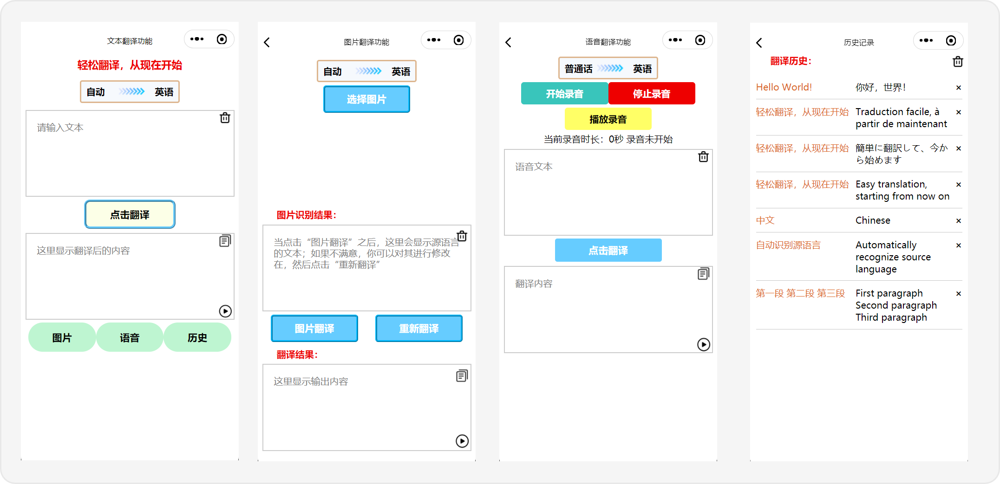
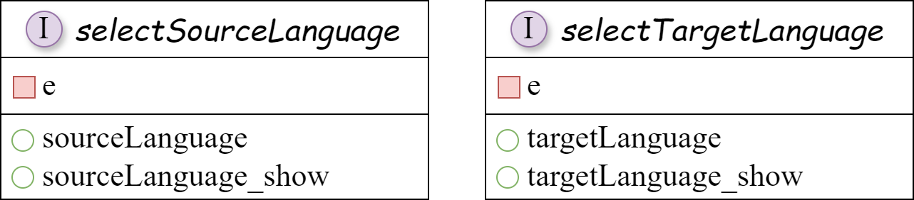
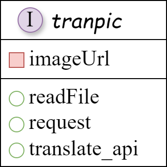
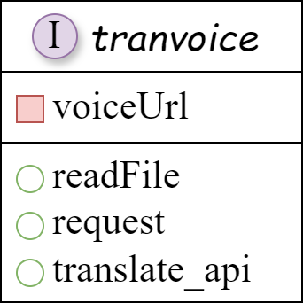
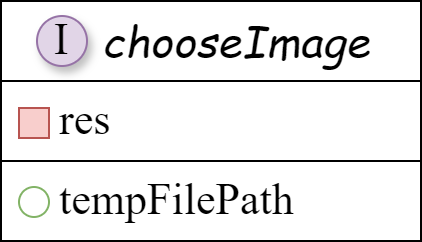
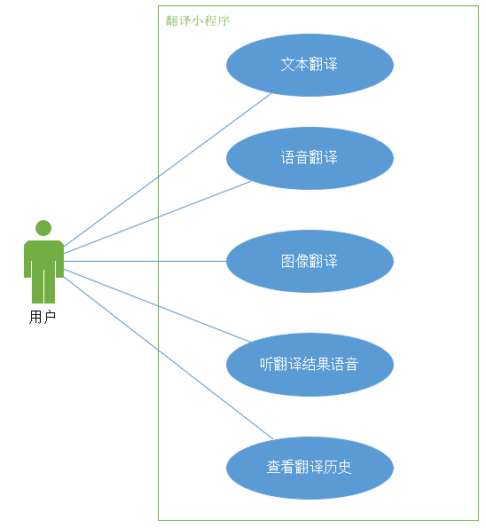
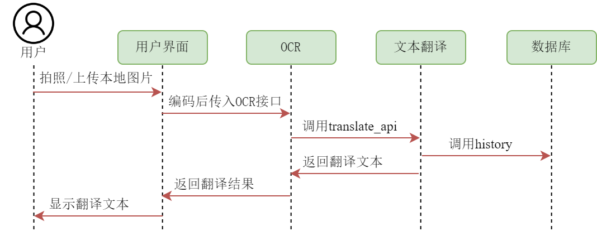
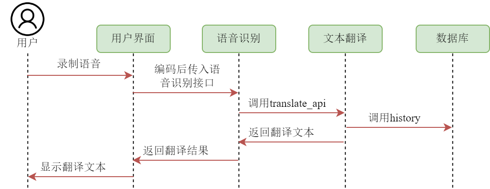
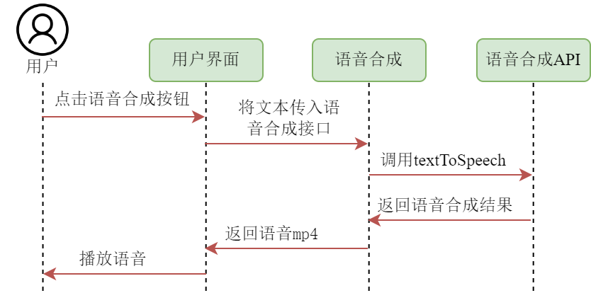
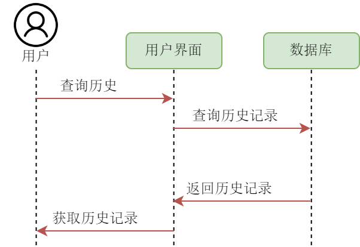

# 一、项目介绍

## 1.项目基本信息
<div align="center">
    
    <h3>设计实践翻译</h3>
</div>

### 扫码体验
<div align="center">
  
</div>

### 界面展示
<div align="center">
  
</div>

### 项目功能
<h4>①多语言翻译功能</h4>
<p>小程序调用百度翻译API，并以此给出自定义的调用API，实现更方便的翻译功能实现。支持中文、英语、日语、法语、意大利语等多语种的翻译。</p>
<h4>②自动识别</h4>
<p>翻译时的输入语言可选择自动识别输入文本的语言类型，优化用户体验</p>
<h4>③历史记录保存</h4>
<p>小程序会将在每一次调用翻译API时记录下相应的原文、翻译语种和译文，保存在本地缓存中</p>
<h4>④图片翻译</h4>
<p>小程序调用第三方OCR识别接口，用户上传图片后，小程序自动将其转化为文本进行翻译。</p>
<h4>⑤语音翻译</h4>
<p>小程序调用第三方语音识别接口，用户在小程序内录制想要翻译的音频，小程序自动将其转化为文本进行翻译。</p>
<h4>⑥语音合成</h4>
<p>小程序调用第三方语音合成接口，用户在翻译完成后可将翻译结果以语音形式播放。</p>

### 项目结构
<p>该项目的主要结构与重要文件如下：</p>

```
·
├─code                            // 代码目录
│  ├─img                          // 小程序内部图像
│  ├─pages                        // 小程序的各个界面
│  │  ├─history                   // 历史界面
│  │  ├─index                     // 主界面
│  │  ├─picture                   // 图片翻译界面
│  │  └─voice                     // 语音翻译界面
│  ├─utils                        // 插件
│  │  ├─baidu-translate-api.js    // 百度翻译API
│  │  ├─md5.min.js                // 鉴权码
│  │  ├─util.js                   // 获取当前时间
│  ├─app.js                       // 入口文件
│  ├─app.json                     // 全局配置
│  └─app.wxss                     // 定义全局样式(输入框等)
│
├─docs                            // 文档目录
│  ├─架构设计.md
│  ├─界面原型文档.md
│  ├─组件接口.md
│  ├─需求分析.md
│  ├─时序图.md
|
└─images                          // 文档图片目录
```

## 2.项目仓库地址
Github仓库：<https://github.com/virtualxiaoman/fanyi_xcx/>

## 3.项目人员
<h3>3.1.宋宇成</h3>

1. **负责Github仓库管理：** 宋宇成负责整个Github仓库的管理工作，包括代码的整理、归档以及版本的管理。同时负责编写详实的README文档，以便于其他团队成员以及可能接触项目的人对项目有明确的了解。
2. **共同进行设计：** 积极参与系统设计，利用在软件工程课上所学与课余积累，帮助设计出高效且易于维护的系统。利用平日里的设计功底，设计简洁美观易实现的界面。帮助分析需求，以减少漏掉的部分。
3. **全局的翻译API：** 百度提供的翻译API调用不够简易，为了便于本小程序各个地方调用`文本翻译为文本`的功能，他将翻译功能定义成`translate_api`，只需要输入文本、源语言、目标语言就能够实现翻译。
4. **全局的文本转语音API：** 微信提供的文本转语音的API也不容易调用，且缺少足够的错误机制，为了在调用时自动查错，他将文本转语音功能定义成`Text2Voice`，只需要输入文本和语种就能实现文本转语音然后输出语音的功能。
5. **各个界面的制作：** 宋宇成积极参与界面原型到界面的开发。他完成了主界面、图片翻译界面、语音翻译界面的制作，并对按钮、输入框等进行统一规定，比如统一成`picker_container,input_container,output_container`而无需在各个页面自行实现这个功能，便于各个界面的相同部分统一管理，减少问题的产生。
6. **主界面的翻译功能：** 宋宇成实现了主界面的文本翻译成文本的功能，调整了按钮之间的布局模式(相对布局)，并增加了清空、复制、朗读等功能，便于用户使用。
7. **图片识别与翻译功能：** 宋宇成实现了拍照或本地上传图片，然后使用OCR转化成对应文本的功能。然后将文本翻译成对应的目标语言。并允许用户修改原文本，避免OCR不准确影响用户使用。
8. **语音录制、暂停、停止等功能：** 宋宇成实现了语音界面的部分功能，方便与前面的统一管理，便于制定各个`container`的关联事件与样式。
9. **性能优化：** 宋宇成将专注于系统的性能优化，通过合理的代码架构和算法优化，他将确保系统在高并发、高延迟等情况下的稳定运行。
10. **编写文档：** 为了保证项目的可维护性和持续性，宋宇成负责编写清晰且详细的开发文档，包括组件接口、时序图等文档，以便于后续的开发和维护工作。

<h3>3.2.周唯</h3>

1. **进行需求分析：** 在理解课题的要求后，深入分析项目的需求与用户使用的情景，并将其转化为用户需求与系统需求两类，同时负责撰写需求分析文档。
2. **共同进行设计：** 一同参与项目的设计，考量每条设计的决策，针对系统的实现向其他开发人员提出优化想法，共同探讨,力争维护系统的可靠性与可用性。
3. **界面的设计与优化：** 周唯将主要负责各个界面原型的设计，独立完成部分界面的开发实现并在其余界面上辅助宋宇成进行优化，完成了历史界面、语音翻译界面，辅助完成了主界面，同时优化了各界面的图标位置，实现响应式设计，避免了各机型屏幕大小不同导致的显示问题。
4. **翻译历史的存储与加载：** 周唯实现了调用主界面翻译服务记录每条历史记录的源文本、译文及翻译语言，显示在历史界面中；同时实现了每条历史均可单独删除，也可选择清空全部历史的功能；此外还负责了重载单条历史到主界面重新翻译的功能。
5. **语音识别与翻译功能：** 周唯实现了接收录制的音频地址，将其转化为Base64编码，并实现调用语音识别接口，将语音转化为文本，翻译为目标语言。修改识别文本与复制翻译文本功能在这里同样适用，满足用户需求。
6. **架构的设计：** 设计了项目系统的整体框架，采用分层架构模式，确保项目各层间的独立性，强化系统可依赖性。
7. **编写文档：** 将自己所负责的部分归档整理，以供其他开发人员更好地掌握系统开发进度，同时便于用户理解项目开发过程与使用方式。
8. **代码优化：** 周唯将协助其他开发人员对系统代码逻辑进行优化，简化冗余代码，使代码逻辑更加清晰，优化项目整体结构，强化项目可维护性。


# 二、需求分析
## 1.功能性需求
### 1.1 用户需求
- 实时翻译反馈：用户希望在输入内容后能够立即获得翻译结果。
- 文本翻译：用户可以在输入框内键入待翻译的文本内容，系统即时识别并开始翻译。
- 语音翻译：用户可以选择输入语言及目标语言，通过语音消息录入文本内容，系统通过语音识别技术将语音转换为文本并进行翻译。
- 图像翻译：用户可以上传包含文字的图片，系统利用OCR（Optical Character Recognition）技术提取文字信息并进行翻译。
- 语音合成：用户在翻译完成后点击播放按钮，翻译结果将以语音的形式进行输出。

### 1.2 系统需求

**(1) 实时响应：**

系统需要能够快速响应用户输入，实时展示翻译结果。系统应能够实时展示翻译过程，让用户了解每一步的操作和翻译结果。在翻译过程中，系统应提供即时反馈，包括翻译错误提示、语法建议等，帮助用户获得更准确的翻译结果。

**(2) 基础翻译功能：**

①初始假设：

用户在小程序中直接选择输入文本，选择输入语言和目标语言，系统翻译后展示结果。

②正常状态：

用户在输入框输入文本，用户手动选择语言后，系统整合多语种翻译引擎，精准翻译文本，确保翻译结果精准度高，避免语义歧义和翻译错误。

③可能错误：

- 系统调用API未响应，或请求被拦截，程序无法进行翻译。
- 输入文本中含无法识别字符，程序提示用户重新输入。

④完成状态：

用户输入待翻译文本后，系统将翻译结果显示在输出框中，并将翻译原文本内容记录在历史记录中。

**(3) 语音识别功能**

①初始假设：

用户希望通过语音输入进行翻译，系统需要具备语音识别功能。

②正常状态：

用户打开小程序并进入语音输入界面。用户开始说话，语音被系统识别，将其自动转化为文字。系统接收到文字后，调用翻译功能进行翻译。

③可能错误：

- 用户环境嘈杂，导致语音识别错误或不准确。

- 网络连接不稳定，导致语音识别服务无法正常工作。

④完成状态：

用户成功通过语音输入进行了翻译。

**(4) OCR识别图像脚本**

①初始假设：

用户选择图像翻译功能，拍照或上传图片翻译其中文字，需要通过第三方OCR功能识别图像中文字并进行翻译。

②正常状态：

用户打开微信，进入翻译小程序，在小程序首页选择图像翻译功能，系统跳转至拍照界面，用户可以使用手机摄像头拍下待识别的图片，或按下图库按钮上传照片。用户选择待译语言后按下翻译按钮，系统调用OCR识别文字，并翻译为目标语言。

③可能错误：

- 系统权限不足：小程序未获得足够的权限无法访问用户图库，导致无法上传图片。

- OCR 服务故障：第三方 OCR 服务出现故障，无法完成文字识别。

- 用户操作失误：用户选择错误的语言种类或目标语言，导致翻译结果不准确。

④完成状态：

用户可以通过 OCR 功能成功识别图片中的文字，并将其翻译成目标语言显示在图片上。

**(5) 语音合成功能**

①初始假设：

用户希望听到翻译后的内容，系统需要提供语音合成功能，将翻译后内容转化为语音形式读出来。

②正常状态：

- 翻译结果显示在界面上。
- 用户点击播放按钮，系统将翻译后的文字内容转换成语音。
- 用户听到翻译后的语音。

③可能错误：

- 语音合成服务出现故障，无法将文字内容转换成语音。
- 用户设备不支持播放音频，导致无法听到翻译结果。

④完成状态：

用户成功听到了翻译后的语音内容。

## 2.非功能性需求
### 2.1 性能需求

- 翻译响应速度应较快，确保用户能够快速得到翻译结果。对于纯文本的输入，输出的延迟不超过1秒；对于图片和语音的输入，输出的延迟不超过5秒。
- 系统需要具备稳定的性能，处理高并发情况下也能正常运行。

### 2.2 安全性需求

- 系统需要保护用户信息的安全，确保用户提交的信息不被泄露。
- 系统需要遵守相关隐私政策，保护用户隐私不受侵犯。

### 2.3 可用性需求

- 系统界面设计应简洁友好，方便用户操作。
- 用户提示功能良好，引导用户正确操作。
- 系统需要提供多语言支持，满足不同用户的需求。
- 系统应该在99.9%的情况下都能正常运行。在出现故障时，也能在1分钟内自行恢复正常。

### 2.4 可维护性需求

- 系统需要易于维护，能够方便地更新和修复bug。
- 系统需要有良好的开发文档和注释，便于后续开发维护和升级。

### 2.5 可扩展性需求

- 系统应设计为模块化结构，方便后续功能扩展。
- 系统需要支持不同的翻译API接入，以满足用户需求的多样性。

### 2.6 用户体验需求

- 系统需要提供流畅的交互体验，减少用户操作的复杂性。
- 系统需要提供高质量的翻译结果，确保用户满意度。


# 三、系统设计
## 3.1 架构设计
- 翻译小程序采用分层架构的模式，示例图如下：
 <div align = "center">
    
</div>

### 3.1.1 表示层（Presentation Layer）

表示层就是展现给客户的界面，用于展示用户输入以及服务端返回的数据。这一层主要负责将用户请求传递给下一层，并将处理结果返回给用户。

### 3.1.2 业务逻辑层（Business Layer）

业务逻辑层用于存放所有的业务实现，是连接表示层与服务层的桥梁，实现了翻译的核心算法和业务逻辑。用户输入的数据通过业务逻辑层的处理发给服务层；服务层返回的数据通过业务逻辑层发送给界面展示。
在我们的翻译小程序中，业务逻辑层主要处理的数据包含用户的输入数据与所采用接口服务返回的翻译结果。

### 3.1.3 服务层（Service Layer）

服务层主要管理数据，负责数据存储和访问，把业务逻辑层提交的用户输入的数据保存，把业务逻辑层请求的数据返回给业务逻辑层。
在我们的翻译小程序中，服务层包括了翻译API获取翻译结果、OCR识别图片中文字和语音合成等接口的调用。


## 3.2 界面原型设计
### 3.2.1 主页面：
   - 输入输出框：输入框用于输入待翻译的文本，输出框用于输出翻译后的文本
   - 翻译框：点击此按钮开始翻译
   - 语言选择框：选择翻译前后的语言
   - 功能框：选择图片、语音、历史界面的按钮
<div>
   
</div>

## 3.2.2 语音输入页面：
   - 页面上方可以设置一个开始录音的按钮。
   - 中间部分可以设置一个显示录音时长的进度条。
   - 页面下方可以设置一个停止录音的按钮，点击后将录音转化为文字并进行翻译。
<div>
   
</div>

## 3.2.3 图片输入页面：
   - 页面上方可以设置一个拍照或者上传图片的按钮。
   - 中间部分可以展示用户选择的图片。
   - 页面下方可以设置一个翻译按钮，点击后进行OCR识别并进行翻译。
<div>
   
</div>

## 3.2.4 历史页面：
   - 用户在里面可以查看翻译历史。
<div>
   
</div>


## 3.3 组件接口设计

翻译小程序组件设计图如下：
<div align = "center">
    
</div>

### 3.3.1 全局的翻译api接口

<div align = "center">
    
</div>

```
:param inputText: [传入]翻译的文本
:param sourceLanguage: [传入]原语言，可选'auto'
:param targetLanguage: [传入]目标语言
```
- `translate(inputText: String, sourceLanguage: String, targetLanguage: String): json`：将inputText从sourceLanguage的语种翻译为targetLanguage的语种，并自动更新历史界面。
- `unshift(dst: str, src: str, from: str, to: str): `更新历史界面的数组
- `setStorageSync(history: list):` 用history数组更新历史界面


### 3.3.2 语种选择接口

<div align = "center">
    
</div>

```
:param e: [传入]一个事件对象，用于处理用户交互事件，捕获触发该函数的事件的相关信息
:param sourceLanguage: [内部]源语言
:param sourceLanguage_show: [内部]源语言(显示在用户界面上，是源语言的ISO 639-1到中文的映射)
:param targetLanguage: [内部]目标语言
:param targetLanguage_show: [内部]目标语言(显示在用户界面上，是目标语言的ISO 639-1到中文的映射)
```


### 3.3.3 主界面的文本翻译接口

<div align = "center">
    
</div>

```
:param inputContent: [内部]输入框所对应的data，输入文本
:return outputContent: 更新输出框对应的data，输出文本
```
- `translate_input(inputText: String): String`：通过调用translate_api，将inputText从sourceLanguage的语种翻译为targetLanguage的语种，并自动更新输出框文本与历史界面。


### 3.3.4 图片翻译接口

<div align = "center">
    
</div>

```
:param imageUrl: [传入]图片地址
:return image_tran: 翻译后的图片
```
- `readFile(imageUrl: String): String(base64)`：将图片从imageUrl读取，并编码为不带前缀的base64编码格式。
- `request(inputbase64: String): json`：通过请求OCR的api，提取图片内的文字和位置信息。
- `translate_input(inputText: String): String`：通过调用translate_api，将inputText从sourceLanguage的语种翻译为targetLanguage的语种，并自动更新输出框文本与历史界面。


### 3.3.5 语音翻译接口

<div align = "center">
    
</div>

```
:param voiceUrl: [传入]语音地址
:return voice_tran: 翻译后的图片
```
- `readFile(voiceUrl: String): String(base64)`：将图片从voiceUrl读取，并编码为不带前缀的base64编码格式。
- `request(inputbase64: String): json`：通过请求语音转文字的api，提取语音文字。
- `translate_input(inputText: String): String`：通过调用translate_api，将inputText从sourceLanguage的语种翻译为targetLanguage的语种，并自动更新输出框文本与历史界面。


### 3.3.6 图片读取翻译接口

<div align = "center">
    
</div>

- `chooseImage(pic: picSource): String`：通过微信的chooseMedia将图片从'album'或'camera'读取，返回值是res，将地址res.tempFiles[0].tempFilePath赋值给tempFilePath，然后更新data里的InputImageUrl。


### 3.3.7 语音读取翻译接口

<div align = "center">
    
</div>

- `getRecorderManager(voice: voiceSource): String`：通过微信的getRecorderManager获取语音文件的地址res.tempFilePath，更新data里的InputVoiceUrl。


### 3.3.8 语音状态切换翻译接口

<div align = "center">
    
</div>

- `state_change(if_voicing: int): function`：当if_voicing=1,2,3依次表示"开始录音","暂停","继续"（不仅会改变录音的状态，还会改变显示在界面上的文本）
- `stop`: fuction: 执行该操作时，停止录音


### 3.3.9 语音转文字接口

<div align = "center">
    
</div>

```
:param InputvoiceUrl: [传入]语音地址
:return voice_text: 识别后的文字
```
- `readFile: String`：读取录音保存的地址
- `request`: text: 向百度API发送请求，获取识别后的文本


### 3.3.10 全局的文字转语音接口

<div align = "center">
    
</div>

```
:param text: [传入]文本
:param language: [传入]文本的语种
:return res: 识别后的结果
```
- `textToSpeech: res`：获取音频，其中`res.filename`是音频的地址
- `play`:使用`wx.createInnerAudioContext()`工具来播放音频。


## 3.4 系统流程分析
- 由需求分析导出以下用例图：
<div align ="center">
   
</div>

- 再由用例图得出以下时序图：
### 3.4.1 文本翻译时序图

<div align = "center">
    
</div>


### 3.4.2 图片翻译时序图

<div align = "center">
    
</div>


### 3.4.3 语音识别时序图

<div align = "center">
    
</div>


### 3.4.4 语音合成时序图

<div align = "center">
    
</div>


### 3.4.5 查询历史时序图

<div align = "center">
    
</div>


# 四、系统实现
