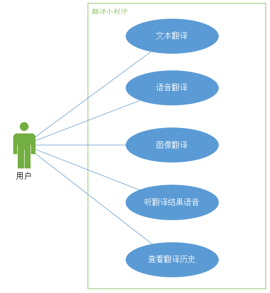

   
    
   图1 翻译小程序用例图

**一、功能性需求**

***用户需求***

- 实时翻译反馈：用户希望在输入内容后能够立即获得翻译结果。
- 文本翻译：用户可以在输入框内键入待翻译的文本内容，系统即时识别并开始翻译。
- 语音翻译：用户可以选择输入语言及目标语言，通过语音消息录入文本内容，系统通过语音识别技术将语音转换为文本并进行翻译。
- 图像翻译：用户可以上传包含文字的图片，系统利用OCR（Optical Character Recognition）技术提取文字信息并进行翻译。
- 语音合成：用户在翻译完成后点击播放按钮，翻译结果将以语音的形式进行输出。

***系统需求：***

**1.实时响应：**

系统需要能够快速响应用户输入，实时展示翻译结果。系统应能够实时展示翻译过程，让用户了解每一步的操作和翻译结果。在翻译过程中，系统应提供即时反馈，包括翻译错误提示、语法建议等，帮助用户获得更准确的翻译结果。

**2.基础翻译功能：**

①初始假设：

用户在小程序中直接选择输入文本，选择输入语言和目标语言，系统翻译后展示结果。

②正常状态：

用户在输入框输入文本，用户手动选择语言后，系统整合多语种翻译引擎，精准翻译文本，确保翻译结果精准度高，避免语义歧义和翻译错误。

③可能错误：

- 系统调用API未响应，或请求被拦截，程序无法进行翻译。
- 输入文本中含无法识别字符，程序提示用户重新输入。

④完成状态：

用户输入待翻译文本后，系统将翻译结果显示在输出框中，并将翻译原文本内容记录在历史记录中。

**3.语音识别功能**

①初始假设：

用户希望通过语音输入进行翻译，系统需要具备语音识别功能。

②正常状态：

用户打开小程序并进入语音输入界面。用户开始说话，语音被系统识别，将其自动转化为文字。系统接收到文字后，调用翻译功能进行翻译。

③可能错误：

用户环境嘈杂，导致语音识别错误或不准确。

网络连接不稳定，导致语音识别服务无法正常工作。

④完成状态：

用户成功通过语音输入进行了翻译。

**4.OCR识别图像脚本**

①初始假设：

用户选择图像翻译功能，拍照或上传图片翻译其中文字，需要通过第三方OCR功能识别图像中文字并进行翻译。

②正常状态：

用户打开微信，进入翻译小程序，在小程序首页选择图像翻译功能，系统跳转至拍照界面，用户可以使用手机摄像头拍下待识别的图片，或按下图库按钮上传照片。用户选择待译语言后按下翻译按钮，系统调用OCR识别文字，并翻译为目标语言。

③可能错误：

系统权限不足：小程序未获得足够的权限无法访问用户图库，导致无法上传图片。

OCR 服务故障：第三方 OCR 服务出现故障，无法完成文字识别。

用户操作失误：用户选择错误的语言种类或目标语言，导致翻译结果不准确。

④完成状态：

用户可以通过 OCR 功能成功识别图片中的文字，并将其翻译成目标语言显示在图片上。

**5.语音合成功能**

①初始假设：

用户希望听到翻译后的内容，系统需要提供语音合成功能，将翻译后内容转化为语音形式读出来。

②正常状态：

- 翻译结果显示在界面上。
- 用户点击播放按钮，系统将翻译后的文字内容转换成语音。
- 用户听到翻译后的语音。

③可能错误：

- 语音合成服务出现故障，无法将文字内容转换成语音。
- 用户设备不支持播放音频，导致无法听到翻译结果。

④完成状态：

用户成功听到了翻译后的语音内容。
    
    
    
**二、非功能性需求**

1.性能需求：

- 翻译响应速度应较快，确保用户能够快速得到翻译结果。对于纯文本的输入，输出的延迟不超过1秒；对于图片和语音的输入，输出的延迟不超过5秒。
- 系统需要具备稳定的性能，处理高并发情况下也能正常运行。

2.安全性需求：

- 系统需要保护用户信息的安全，确保用户提交的信息不被泄露。
- 系统需要遵守相关隐私政策，保护用户隐私不受侵犯。

3.可用性需求：

- 系统界面设计应简洁友好，方便用户操作。
- 用户提示功能良好，引导用户正确操作。
- 系统需要提供多语言支持，满足不同用户的需求。
- 系统应该在99.9%的情况下都能正常运行。在出现故障时，也能在1分钟内自行恢复正常。

4.可维护性需求:

- 系统需要易于维护，能够方便地更新和修复bug。
- 系统需要有良好的开发文档和注释，便于后续开发维护和升级。

5.可扩展性需求：

- 系统应设计为模块化结构，方便后续功能扩展。
- 系统需要支持不同的翻译API接入，以满足用户需求的多样性。

6.用户体验需求：

- 系统需要提供流畅的交互体验，减少用户操作的复杂性。
- 系统需要提供高质量的翻译结果，确保用户满意度。
